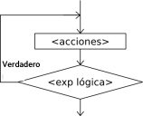

# Estructuras repetitivas: do - while

La instrucción `do-while` ejecuta una secuencia de instrucciones mientras que la condición sea verdadera.

    do
    {
	    instrucciones;
    }
    while(condición lógica);

* Al ejecutarse esta instrucción, la secuencia de instrucciones que forma el cuerpo del ciclo se ejecuta una vez y luego se evalúa la condición. Si la condición es verdadera, el cuerpo del ciclo se ejecuta nuevamente y se vuelve a evaluar la condición. Esto se repite hasta que la condición sea falsa.
* Note que, dado que la condición se evalúa al final, las instrucciones del cuerpo del ciclo serán ejecutadas al menos una vez.
* Además, a fin de evitar ciclos infinitos, el cuerpo del ciclo debe contener alguna instrucción que modifique la o las variables involucradas en la condición de modo que en algún momento la condición sea false y se finalice la ejecución del ciclo.

## Ejemplo:

Crea un programa que pida al usuario una contraseña, de forma repetitiva mientras que no introduzca "asdasd". Cuando finalmente escriba la contraseña correcta, se le dirá "Bienvenido" y terminará el programa.

    #include <iostream>
    using namespace std;
    
    int main(int argc, char *argv[]) {
    	string secreto, clave;
    	secreto = "asdasd";
    	do
    	{
    			cout << "Dime la clave:";
    			getline(cin,clave);
    			if (clave!=secreto) cout << "Clave incorrecta!!!" << endl;
    	} while(clave!=secreto);
    	cout << "Bienvenido!!!" << endl;
    	cout << "Programa terminado";
    	return 0;
    }
