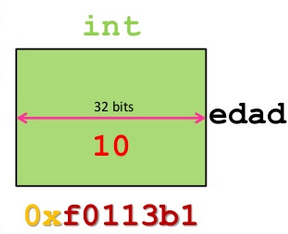
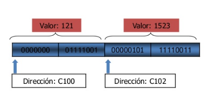
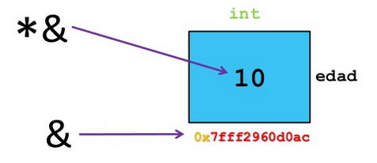

# Introducción a los punteros (I)

Hemos estudiado que las variables nos permiten guardar valores de distintos tipos en la memoria RAM del ordenador. Cada posición de memoria donde guardamos un dato tiene una dirección de memoria que nos permite localizar ea posición.

Es decir al trabajar con variables tenemos que tener en cuenta 5 elementos:

* Nombre
* Tipo de datos
* Tamaño
* Valor
* Dirección de memoria

Veamos un ejemplo:

Si, por ejemplo definimos dos enteros:

    int m=121, n=1523;

Tendremos 4 posiciones de memoria (el tipo entero se guarda en dos posiciones) donde se guarda el valor de las dos variables, cada posición tiene una dirección de memoria consecutiva:

## Los operadores & y *

Tenemos dos operadores para trabajar sobre las variables:

* `&`: Nos devuelve **la dirección de memoria** de una variable.
* `*`: Nos devuelve **el contenido** de una determinada dirección de memoria.

El operador `&` se ejecuta sobre una variable, el operador `*` se ejecuta sobre una dirección de memoria (por eso en la imagen vemos `*&`).

Veamos un ejemplo:

    using namespace std;

    int main(int argc, char *argv[]) {
    	int edad=10;
    
    	cout << &edad << endl; //Mostramos la dirección de memoria donde se guarda la variable
    	cout << *&edad << endl; //Mostramos el contenido de la variable guardada en esa dirección 
    	*&edad = 12; //Podemos cambiar el contenido de la variable de esa dirección.
    	cout << edad << endl; //Comprobamos que la variable ha cambiado
    	return 0;
    }

**Nota: Las imágenes de esta unidad se han obtenido de: https://www.slideshare.net/CesarOsorio2/punteros-y-funciones**